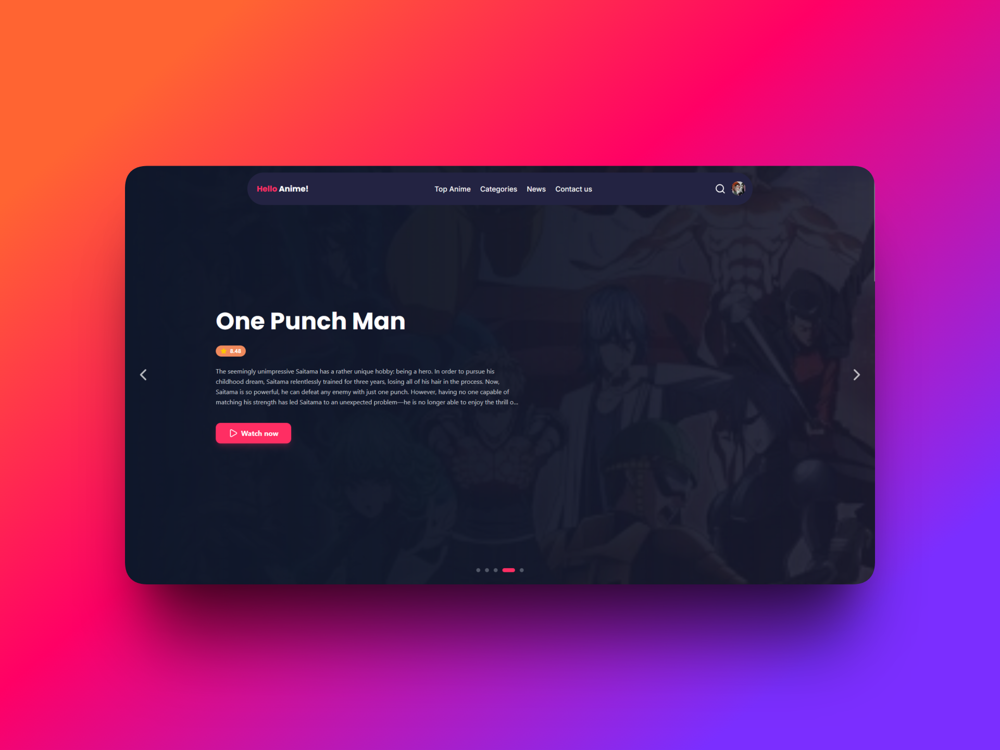
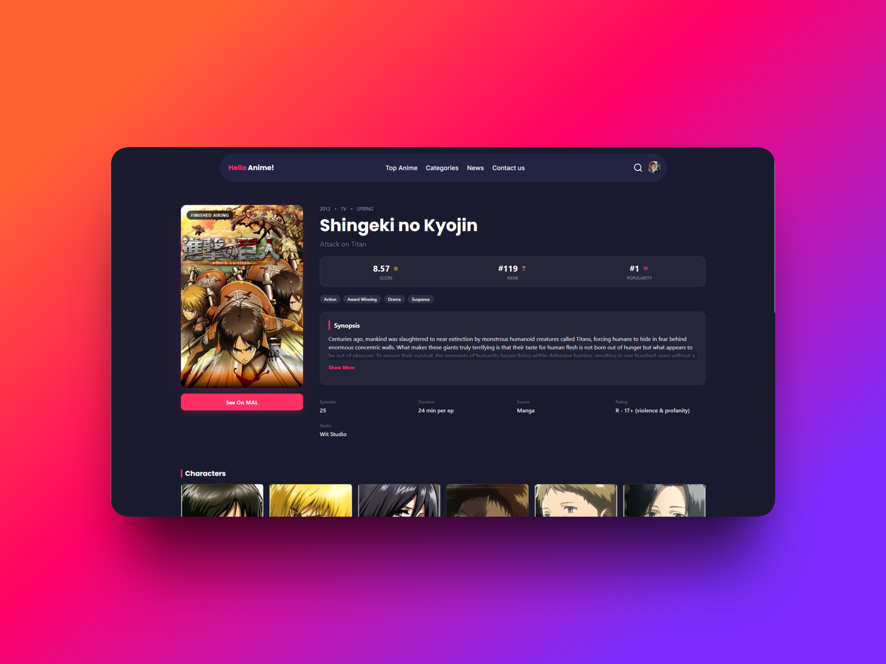
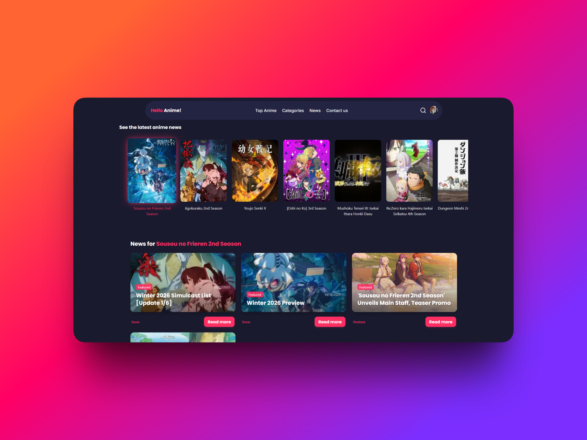
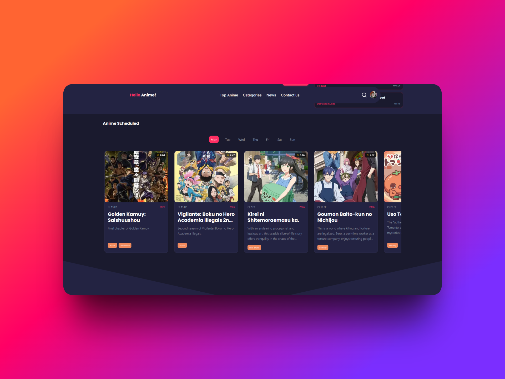

# HelloAnime 🌸

A captivating web application designed for anime enthusiasts to effortlessly discover, explore, and search for their favorite Japanese animations. Powered by the [Jikan API](https://jikan.moe/) (an unofficial MyAnimeList API), HelloAnime offers a sleek, responsive, and animated user experience built with modern web technologies.

## ✨ Features

- **🎬 Top & Trending Anime:** Discover the most popular and highly-rated anime series instantly.
- **📅 Anime Calendar:** Keep track of airing schedules so you never miss an episode of your ongoing favorite shows.
- **📰 Anime News:** Stay updated with the latest news from the anime industry directly within the app.
- **🔍 Dynamic Search:** Find any anime quickly with a smooth, debounced search experience.
- **📝 Rich Details:** View comprehensive information including synopsis, score, episodes, genres, and characters.
- **📱 Responsive & Mobile-First:** Designed to look and feel amazing on all devices, from desktops to mobile phones.
- **✨ Smooth Animations:** Powered by **Framer Motion** for a fluid and engaging user interface.
- **🔐 User Accounts:** Integrated authentication (via NextAuth) to personalize your experience.

## 📸 Screenshots

|             Home Page             |              Anime Details               |
| :-------------------------------: | :--------------------------------------: |
|  |  |

|             News Feed             |               Calendar                |
| :-------------------------------: | :-----------------------------------: |
|  |  |

## 🛠️ Tech Stack

HelloAnime is built with a cutting-edge stack to ensure performance, scalability, and developer experience.

- **Framework:** [Next.js 16](https://nextjs.org/) (App Router) 🚀
- **Language:** [TypeScript](https://www.typescriptlang.org/) 🟦
- **Styling:** [Tailwind CSS v4](https://tailwindcss.com/) 🎨
- **State & UI:**
  - [React 19](https://react.dev/)
  - [Framer Motion](https://www.framer.com/motion/) (Animations)
  - [Swiper](https://swiperjs.com/) (Carousels/Sliders)
  - [Lucide React](https://lucide.dev/) (Icons)
  - [React Intersection Observer](https://github.com/thebuilder/react-intersection-observer)
- **Authentication:** [NextAuth.js](https://next-auth.js.org/) 🔐
- **Utilities:** `clsx`, `tailwind-merge`

## 🚀 Getting Started

Follow these steps to get a local copy up and running.

### Prerequisites

- [Node.js](https://nodejs.org/) (LTS recommended)
- [pnpm](https://pnpm.io/) (Current lockfile uses pnpm)

### Installation

1.  **Clone the repository:**

    ```bash
    git clone https://github.com/Bartlomiejczak/Hello-Anime.git
    cd helloanime
    ```

2.  **Install dependencies:**

    ```bash
    pnpm install
    ```

3.  **Run the development server:**

    ```bash
    pnpm dev
    ```

4.  **Open the app:**
    Visit [http://localhost:3000](http://localhost:3000) in your browser.

## 🤝 Contributing

We welcome contributions from the community! Whether it's fixing a bug, adding a new feature, or improving documentation, your help is appreciated.

Please read our [**Contributing Guidelines**](CONTRIBUTING.md) for details on our code of conduct, and the process for submitting pull requests to us.

## 🔗 API Reference

This project utilizes the [Jikan API](https://jikan.moe/) v4.

- **Base URL:** `https://api.jikan.moe/v4`
- **Documentation:** [Jikan Docs](https://docs.api.jikan.moe/)

## 📜 License

Distributed under the MIT License. See `LICENSE` for more information.

---

Made with ❤️ by [Kacper Bartlomiejczak](https://github.com/KacperBartlomiejczak)
